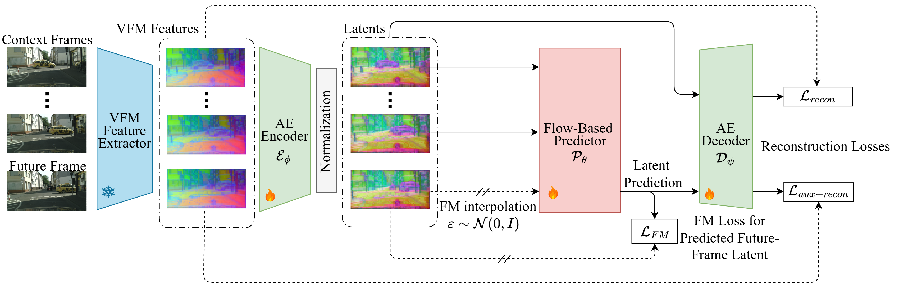

<div align="center">
<h1>Latent-Foresight: End-to-End Learning Predictable Representations for Latent World Models</h1>

**Efstathios Karypidis<sup>1,2,3&#42;</sup>, Spyros Gidaris<sup>2</sup>, Nikos Komodakis<sup>1,4,5</sup>**

<sup>1</sup>Archimedes/Athena RC <sup>2</sup>valeo.ai  
<sup>3</sup>National Technical University of Athens  <sup>4</sup>University of Crete   <sup>5</sup>IACM-Forth

<sup>&#42;</sup><i>Part of this work was done during an internship at valeo.ai</i>

[](https://arxiv.org/abs/2610.01942)
[](https://opensource.org/licenses/MIT)
[](https://huggingface.co/Sta8is/Latent-Foresight_cs)


</div>



<br>

This repository contains the official implementation of the paper: **Latent-Foresight: End-to-End Learning Predictable Representations for Latent World Models**

# Contents
1. [News](#news)
2. [Installation](#installation)
3. [Datasets-Preprocessing](#datasets-preprocessing)
4. [Latent-Foresight Training](#latent-foresight-training)
5. [Downstream Tasks](#downstream-tasks)
6. [Evaluation](#evaluation)
7. [Demo](#demo)
8. [Acknowledgements](#acknowledgements)
9. [Citation](#citation)


# News
- **2026-10-2**: [Arxiv Preprint](https://arxiv.org/abs/2610.01942) and code are released (more updates soon)!


# Installation
We use [uv](https://docs.astral.sh/uv/) to manage the Python environment and install dependencies.
The code is tested with Python 3.10, PyTorch 2.6.0 (CUDA 12.6) and PyTorch Lightning 2.6.6 on Linux.

First, install uv (standalone installer):
```bash
curl -LsSf https://astral.sh/uv/install.sh | sh
```

Clone the repository and install the dependencies. `uv sync` creates the virtual environment in `.venv` and installs the exact package versions pinned in `uv.lock`:
```bash
git clone https://github.com/Sta8is/Latent-Foresight
cd Latent-Foresight
uv sync
```

Activate the environment:
```bash
source .venv/bin/activate
```

# Datasets-Preprocessing
## Cityscapes
Download and prepare Cityscapes by following the [dataset preparation instructions of Dino-Foresight](https://github.com/Sta8is/DINO-Foresight#dataset-preparation). We use the `leftImg8bit_sequence` package for training, and the same label preparation for the downstream tasks.

## Feature statistics
The code normalizes the DINOv2 features with precomputed per-channel mean and standard deviation. You can download the statistics from [Hugging Face](https://huggingface.co/Sta8is/Latent-Foresight_cs/blob/main/dinov2_stats.pth) and pass the file with `--meanstd_ckpt`. To download it via command line:
```bash
wget https://huggingface.co/Sta8is/Latent-Foresight_cs/resolve/main/dinov2_stats.pth
```

## Other datasets
Instructions for the remaining datasets (nuScenes, CoVLA and Kubric) will be announced soon.

# Latent-Foresight Training
The training of Latent-Foresight is divided into two stages. In the first stage, we train the model at low resolution (224x448) and in the second stage we fine-tune the model at high resolution (448x896). The commands below are for **Cityscapes** and assume a single machine with 16 GPUs. You can also run them with the provided scripts [train_lowres_cs.sh](train_lowres_cs.sh) and [train_highres_cs.sh](train_highres_cs.sh).

## Stage 1: Train at low resolution 224x448
To train Latent-Foresight on Cityscapes at low resolution 224x448 using default hyperparameters run the following command:
```bash
python train.py --num_workers=16 --num_workers_val=4 --num_gpus=16 --precision 16-mixed --eval_freq 10 --batch_size 4 --max_epochs 800 \
    --hidden_dim 1152 --heads 8 --layers 12 --dropout 0.1 --lr_base 8e-5 --optimizer "adamw" --weight_decay 0.2 \
    --eval_mode_during_training --evaluate --single_step_sample_train --seperable_attention --random_horizontal_flip --random_crop --use_fc_bias \
    --dataset "cityscapes" --cs_data_path "/path/to/cityscapes/leftImg8bit_sequence" --sequence_length 5 --d_layers 2,5,8,11 \
    --meanstd_ckpt "/path/to/dinov2_stats.pth" --dst_path "/logdir/latent_foresight_cs_lowres/" \
    --P_mean -2 --P_std 1.5 --use_recon_losses --detach_future --detach_target \
    --bottleneck_dim 256 --ae_hidden_dim 1536 --ae_layers 2 --ae_attn_heads 6 --ae_norm_type "bn" --use_rope --sync_batch_norm
```
You can also download the pre-trained model from [here](https://huggingface.co/Sta8is/Latent-Foresight_cs/blob/main/latent_foresight_cs_lowres.ckpt). To download the pre-trained model via command line:
```bash
wget https://huggingface.co/Sta8is/Latent-Foresight_cs/resolve/main/latent_foresight_cs_lowres.ckpt
```

## Stage 2: Fine-tune at high resolution 448x896
To fine-tune Latent-Foresight on Cityscapes at high resolution 448x896 using default hyperparameters run the following command:
```bash
python train.py --num_workers=16 --num_workers_val=4 --num_gpus=16 --precision 16-mixed --eval_freq 5 --batch_size 1 --accum_iter 4 --max_epochs 40 \
    --img_size 448,896 --hidden_dim 1152 --heads 8 --layers 12 --dropout 0.1 --lr_base 1e-5 --optimizer "adamw" --weight_decay 0.2 \
    --eval_mode_during_training --evaluate --single_step_sample_train --seperable_attention --random_horizontal_flip --random_crop --use_fc_bias \
    --dataset "cityscapes" --cs_data_path "/path/to/cityscapes/leftImg8bit_sequence" --sequence_length 5 --d_layers 2,5,8,11 \
    --meanstd_ckpt "/path/to/dinov2_stats.pth" --dst_path "/logdir/latent_foresight_cs_highres/" \
    --P_mean -2 --P_std 1.5 --use_recon_losses --detach_future --detach_target \
    --bottleneck_dim 256 --ae_hidden_dim 1536 --ae_layers 2 --ae_attn_heads 6 --ae_norm_type "bn" --use_rope --sync_batch_norm \
    --high_res_adapt --ckpt "/path/to/latent_foresight_cs_lowres.ckpt"
```
You can also download the pre-trained model from [here](https://huggingface.co/Sta8is/Latent-Foresight_cs/blob/main/latent_foresight_cs.ckpt). To download the pre-trained model via command line:
```bash
wget https://huggingface.co/Sta8is/Latent-Foresight_cs/resolve/main/latent_foresight_cs.ckpt
```

## Scaling the training data
**Scaling the training data improves Latent-Foresight.** Training on the combination of Cityscapes, nuScenes and CoVLA gives a model that performs better than the one trained on Cityscapes alone. We release the high-resolution (448x896) checkpoint of this model: [latent_foresight_csnscovla.ckpt](https://huggingface.co/Sta8is/Latent-Foresight_csnscovla/blob/main/latent_foresight_csnscovla.ckpt).

To download the pre-trained model via command line:
```bash
wget https://huggingface.co/Sta8is/Latent-Foresight_csnscovla/resolve/main/latent_foresight_csnscovla.ckpt
```
To train it yourself, use the same two-stage commands as above and replace the dataset arguments with
```bash
--dataset "multisource" --cs_data_path "/path/to/cityscapes/leftImg8bit_sequence" --ns_data_path "/path/to/nuscenes" --covla_data_path "/path/to/CoVLA-Dataset/images"
```
(for Stage 2 we use `--max_epochs 50`). The model is evaluated with the [evaluation commands](#evaluation) by setting `--ckpt` to this checkpoint.

# Downstream Tasks
We provide DPT heads for semantic segmentation, depth estimation and surface normal estimation, together with their oracle results. For more details, refer to [Downstream Tasks](Downstream/README.md).

# Evaluation
To evaluate the predicted features on the downstream tasks (on Cityscapes), run the following commands. They use the high-resolution model [latent_foresight_cs.ckpt](https://huggingface.co/Sta8is/Latent-Foresight_cs/blob/main/latent_foresight_cs.ckpt) and the DPT heads described in [Downstream Tasks](Downstream/README.md). To download everything via command line:
```bash
hf download Sta8is/Latent-Foresight_cs latent_foresight_cs.ckpt dinov2_stats.pth head_segm.pth head_depth.pth head_normals.pth --local-dir checkpoints
```

## Semantic Segmentation
```bash
python train.py --num_workers=16 --num_workers_val=8 --num_gpus=1 --precision 16-mixed --eval_freq 10 --batch_size 1 --hidden_dim 1152 --heads 8 --layers 12 --dropout 0.1 --img_size 448,896 --max_epochs 20 \
    --eval_mode_during_training --evaluate --single_step_sample_train --lr_base 8e-5 --seperable_attention --random_horizontal_flip --accum_iter 8 \
    --random_crop --use_fc_bias --dataset "cityscapes" --sequence_length 5 --d_layers 2,5,8,11 \
    --cs_data_path "/path/to/cityscapes/leftImg8bit_sequence" \
    --optimizer "adamw" --weight_decay 0.2 --dst_path "/logdir/eval" --step 1 --eval_ckpt_only \
    --P_mean -2.0 --P_std 1.5 --use_recon_losses --detach_future --detach_target --eval_midterm \
    --bottleneck_dim 256 --ae_hidden_dim 1536 --ae_layers 2 --ae_attn_heads 6 --use_rope --ae_norm_type "bn" \
    --ckpt "/path/to/latent_foresight_cs.ckpt" \
    --head_ckpt "/path/to/head_segm.pth" --eval_modality "segm" --num_classes 19 \
    --meanstd_ckpt "/path/to/dinov2_stats.pth" \
    --dpt_out_channels 128,256,512,512 --use_bn --nfeats 256 --compute_frechet_distance
```

## Depth Estimation
```bash
python train.py --num_workers=16 --num_workers_val=8 --num_gpus=1 --precision 16-mixed --eval_freq 10 --batch_size 1 --hidden_dim 1152 --heads 8 --layers 12 --dropout 0.1 --img_size 448,896 --max_epochs 20 \
    --eval_mode_during_training --evaluate --single_step_sample_train --lr_base 8e-5 --seperable_attention --random_horizontal_flip --accum_iter 8 \
    --random_crop --use_fc_bias --dataset "cityscapes" --sequence_length 5 --d_layers 2,5,8,11 \
    --cs_data_path "/path/to/cityscapes/leftImg8bit_sequence" \
    --optimizer "adamw" --weight_decay 0.2 --dst_path "/logdir/eval" --step 1 --eval_ckpt_only \
    --P_mean -2.0 --P_std 1.5 --use_recon_losses --detach_future --detach_target --eval_midterm \
    --bottleneck_dim 256 --ae_hidden_dim 1536 --ae_layers 2 --ae_attn_heads 6 --use_rope --ae_norm_type "bn" \
    --ckpt "/path/to/latent_foresight_cs.ckpt" \
    --head_ckpt "/path/to/head_depth.pth" --eval_modality "depth" --num_classes 256 \
    --meanstd_ckpt "/path/to/dinov2_stats.pth" \
    --dpt_out_channels 128,256,512,512 --use_bn --nfeats 256 --compute_frechet_distance
```

## Surface Normal Estimation
```bash
python train.py --num_workers=16 --num_workers_val=8 --num_gpus=1 --precision 16-mixed --eval_freq 10 --batch_size 1 --hidden_dim 1152 --heads 8 --layers 12 --dropout 0.1 --img_size 448,896 --max_epochs 20 \
    --eval_mode_during_training --evaluate --single_step_sample_train --lr_base 8e-5 --seperable_attention --random_horizontal_flip --accum_iter 8 \
    --random_crop --use_fc_bias --dataset "cityscapes" --sequence_length 5 --d_layers 2,5,8,11 \
    --cs_data_path "/path/to/cityscapes/leftImg8bit_sequence" \
    --optimizer "adamw" --weight_decay 0.2 --dst_path "/logdir/eval" --step 1 --eval_ckpt_only \
    --P_mean -2.0 --P_std 1.5 --use_recon_losses --detach_future --detach_target --eval_midterm \
    --bottleneck_dim 256 --ae_hidden_dim 1536 --ae_layers 2 --ae_attn_heads 6 --use_rope --ae_norm_type "bn" \
    --ckpt "/path/to/latent_foresight_cs.ckpt" \
    --head_ckpt "/path/to/head_normals.pth" --eval_modality "surface_normals" --num_classes 3 \
    --meanstd_ckpt "/path/to/dinov2_stats.pth" \
    --dpt_out_channels 128,256,512,512 --use_bn --nfeats 256 --compute_frechet_distance
```

# Demo
To be released soon!

# Acknowledgements
Our code is partially based on [Dino-Foresight](https://github.com/Sta8is/DINO-Foresight).

# Citation
If you found Latent-Foresight useful in your research, please consider starring ⭐ us on GitHub and citing 📚 us in your research!
```bibtex
@article{karypidis2026latent,
  title={Latent-Foresight: End-to-End Learning Predictable Representations for Latent World Models},
  author={Karypidis, Efstathios and Gidaris, Spyros and Komodakis, Nikos},
  journal={arXiv preprint arXiv:2610.01942},
  year={2026}
}
```


